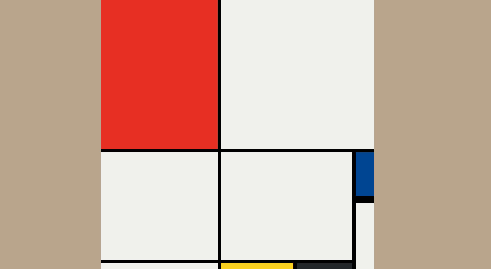

# Mondrian Painting with CSS Grid 🎨

A simple, responsive recreation of a Piet Mondrian-style painting using only HTML and CSS Grid. This project helped me apply core concepts of CSS Grid layout, such as grid sizing, item placement, and responsive design techniques.

## 🖼️ Project Description

This project is a tribute to the iconic style of Dutch painter Piet Mondrian. Using modern CSS Grid techniques, I created a layout that mimics the abstract geometric compositions Mondrian is known for. The painting is fully responsive and adapts to different screen sizes without losing its layout integrity.

The project served as a hands-on exercise to explore:
- Grid container and item properties
- `grid-template-columns` and `grid-template-rows`
- `grid-column`, `grid-row` placement
- Fractional units (`fr`), `minmax()`, and auto-layout behavior
- Responsive adjustments using relative units and media queries (if used)

## 🚀 Features

- Pure HTML and CSS (no JavaScript)
- Responsive design
- Clean, minimal structure
- Pixel-perfect grid layout
- Inspired by modern art

# Folder-structure 
mondrian-css-grid/
│
├── index.html
├── style.css
└── README.md
## 📸 Screenshot


## 📚 Learnings

Through this project, I gained hands-on experience in:
- Laying out items using `display: grid`
- Understanding grid line-based placement
- Creating visual balance using color and proportion
- Making designs responsive using flexible sizing

## 🛠️ Technologies Used

- HTML5
- CSS3 (CSS Grid)

## ✅ How to Run

1. Clone the repository:
   ```bash
   git clone https://github.com/vip23anchib/grid-mondrian-project.git


